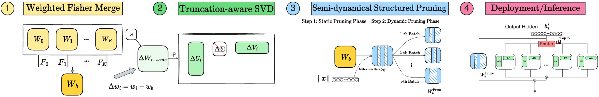

# $D^2$-MoE
> **[$D^2$-MoE: Delta Decompression for MoE-based LLMs Compression](https://arxiv.org/abs/2306.00978)**   
> *Hao Gu<sup>1</sup>, Wei Li<sup>2</sup>, Lujun Li<sup>1</sup>, Qiyuan Zhu<sup>1</sup>, Mark Lee<sup>2</sup>, Shengjie Sun<sup>3</sup>, Wei Xue<sup>1</sup>, Yike Guo<sup>1</sup>*   
> *<sup>1</sup>Hong Kong University of Science and Technology,   <sup>2</sup>University of Birmingham,   <sup>3</sup>AISpeech Co* 




This repository contains the code implementation of D^2-MoE, a framework for compressing Mixture-of-Experts (MoE) based Large Language Models (LLMs) through delta decompression. D^2-MoE aims to reduce the parameters of MoE LLMs without the need for additional training. 

## Overview

D^2-MoE introduces a delta decompression method for compressing MoE LLMs. It strategically decomposes expert weights into a shared base weight and expert-specific delta weights to reduce redundancy and improve compression efficiency. The framework is designed to balance compression ratios while maintaining model performance.

## Install
```
pip install -r requirements.txt
pip install flash-attn==2.5.9.post1
cd lm-evaluation-harness
pip install -e .
```

## Quick Start with Mixtral
```
bash mixtral.sh
```
modify the save_path and base_model_path


## Step by Step Instructions

### 1.get the experts frequency
```
python preprocess/get_expert_freq.py \
    --base_model_path=your_model_path \
    --save_path=your_save_path \
    --model_type=mixtral \
    --dataset_name=wikitext \
    --split=train \
    --seed=42 \
    --max_samples=20000 \
```

### 2.get fisher information to merge experts into a Base expert
```
python preprocess/get_fisher.py \
    --base_model_path=your_model_path \
    --save_path=your_save_path \
    --num_samples=1024 \
	--scale_type fisher \
```

### 3.get the scaling matrix to compress delta weights
```
python preprocess/get_scale.py \
    --base_model_path=your_model_path \
    --save_path=your_save_path \
    --model_type=mixtral \
    --dataset_name=wikitext \
    --split=train \
    --seed=42 \
    --max_samples=256 \
```

### 4.run the D2-MoE
the total compression ratio can be calucate by cal_params.py with pp_ratio and delta_ratio; do not modify --control_name

get delta ratio
target_compression_ratio means the final compress ratio you want, pp_ratio means the pruning ratio of base weight
given a target_compression_ratio, higher pp_ratio means faster inference speed with compress model, and lower pp_ratio with higher delta_ratio retain more model abilities
```
python cal_params.py \
    --model_type mixtral \
	--model_path your_mixtral_model_path \
	--target_compression_ratio 0.6 \
	--pp_ratio 0.2
```


run mixtral
```
python D2-mixtral.py \
    --control_name=wikitext-2v1_llama-2-7b_clm_20_1024_0.1_ppwandasp_probe-default_sync_c4-2000_0.5+0.05-0.5+0.05-0.5+0.05-0.5+0.05-0.5+0.05-seqrank+bszrank_default \
    --base_model_path=your_mixtral_model_path \
    --expert_freq_path=your_expert_freq_path \
    --fisher_path=your_fisher_path \
    --svd_scale_path=your_svd_scale_path \
    --result_path=your_result_path \
    --pp_ratio=0.2 \
    --delta_ratio=0.8 \
    --share_ratio=1 \
    --merge_method=fisher \
```
run deepseek
```
python D2-deepseek.py \
    --control_name=wikitext-2v1_llama-2-7b_clm_20_1024_0.1_ppwandasp_probe-default_sync_c4-2000_0.5+0.05-0.5+0.05-0.5+0.05-0.5+0.05-0.5+0.05-seqrank+bszrank_default \
    --base_model_path=your_mixtral_model_path \
    --expert_freq_path=your_expert_freq_path \
    --fisher_path=your_fisher_path \
    --svd_scale_path=your_svd_scale_path \
    --result_path=your_result_path \
    --pp_ratio=0.2 \
    --delta_ratio=0.8 \
    --share_ratio=1 \
    --merge_method=fisher \
```

## Citation 

If you find D^2-MoE useful in your research, please consider citing the following paper:

```
@inproceedings{gu2025,
title={D^2-MoE: Delta Decompression for MoE-based LLMs Compression},
author={Gu, Hao and Li, Wei and Li, Lujun and Qiyuan, Zhu and Lee, Mark and Sun, Shengjie and Xue, Wei and Guo, Yike},
year={2025}
}

```


